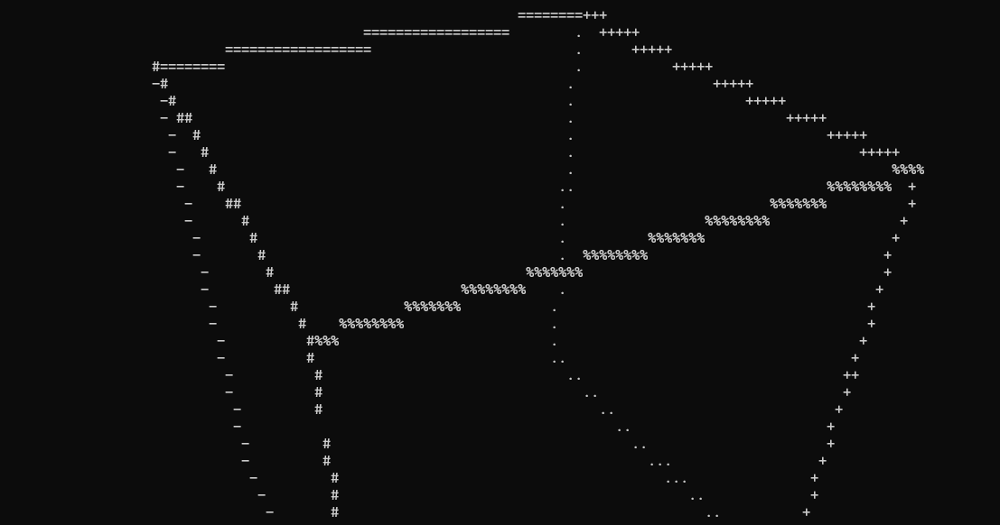
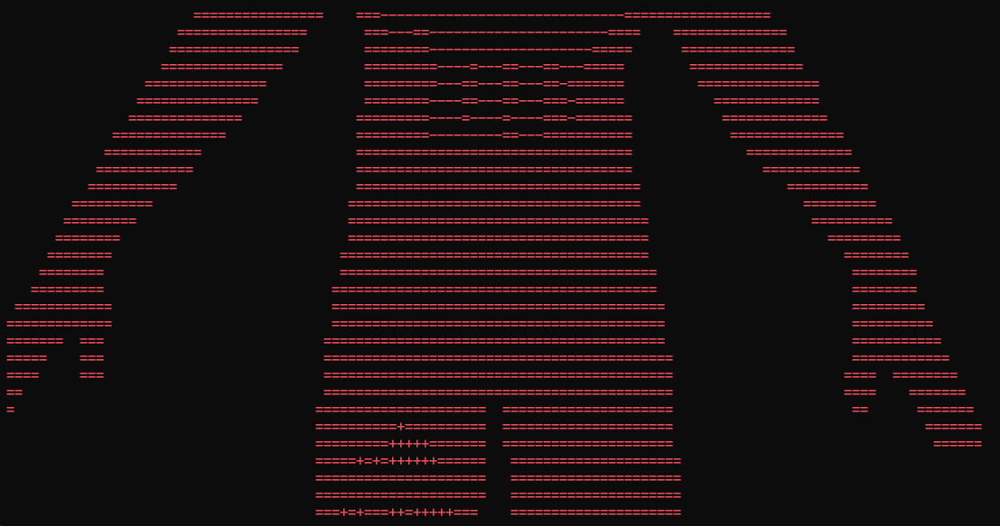

# 3D Console Renderer

ASCII 3D wireframe renderer for the Windows console. Loads OBJ models and displays them rotating

## Build/Compile
```
gcc renderer.c -o renderer.exe -lm
```

## Usage

```
renderer.exe <model.obj> [scale] [dist] [color]
```

- `scale` – projection zoom (optional, default is 55)
- `dist` – distance from camera (optional, default is 3)
- `color` – `r`, `g`, or `b` (optional)


**Higher scale values and closer view dist result in a more detailled representation, default values may not fit to every 3D model**
  
## Examples

```
renderer.exe .\demo-models\cube.obj
renderer.exe .\demo-models\cube.obj 100
renderer.exe .\demo-models\cube.obj 100 4
renderer.exe .\demo-models\cube.obj 100 4 g
```

Press `Ctrl + C` to quit and type `cls` to clear and reuse again




